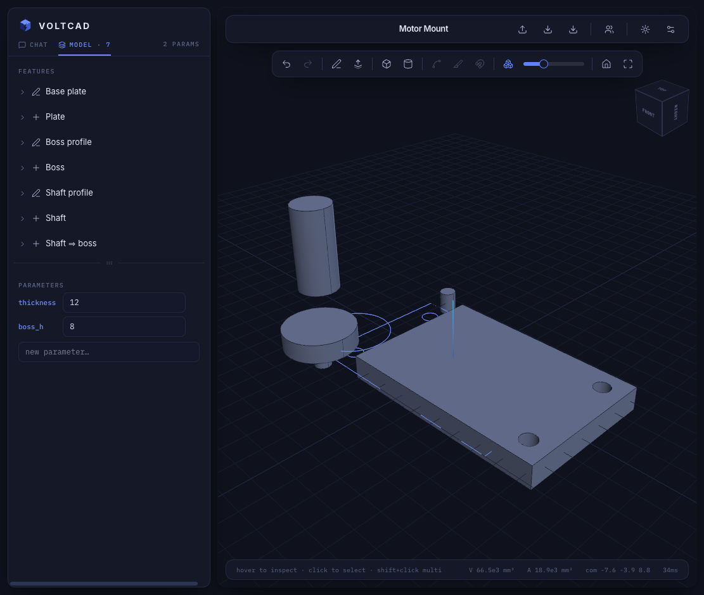

<p align="center">
  
</p>

<h1 align="center">VoltCAD</h1>

<p align="center">
  <b>Browser-based parametric CAD with realtime collaboration and an AI spatial copilot.</b><br/>
  A full B-Rep modeling kernel, feature history, assemblies and multiplayer editing — no install, no backend required to model.
</p>



## What it is

VoltCAD is a parametric, history-based CAD editor that runs entirely in the browser. Geometry is computed by **OpenCascade (OCCT) compiled to WebAssembly** inside a Web Worker; the document is a small, deterministic feature list — every regeneration replays your design history, so models stay fully editable forever.

## Features

**Modeling**

- Sketching with a real constraint solver (planegcs, the FreeCAD GCS solver): coincident, horizontal/vertical, parallel, perpendicular, tangent, equal, distance, radius, angle — with live DOF feedback and conflict diagnostics
- Extrude (new/add/cut/intersect), revolve, **sweep**, **loft**, fillet, chamfer, shell, linear/circular patterns, mirror, booleans
- **Datum planes** (offset / rotated / from faces), sketch-on-face, construction geometry
- Named **parameters with expressions** (`wall_t * 2`) driving any dimension
- Feature suppression, rollback bar, and per-feature error isolation — one failed feature never takes down the model

**Assemblies**

- Onshape-style **mates**: snap a face of one body onto another with flip / offset / angle control; mates are history features, so they re-solve parametrically
- **Exploded view** with a distance slider — pure display transform, the document is untouched

**Collaboration (Figma-style)**

- The document is a **CRDT (Yjs)** — realtime multiplayer editing through a tiny relay server, with presence avatars and live selection sharing
- Only the feature list syncs; each client regenerates geometry locally, so collaboration payloads are bytes, not meshes
- Conflict-free offline editing: undo only ever reverts _your_ changes, never a collaborator's
- Multiple tabs on the same machine stay in sync with zero servers (BroadcastChannel)

**Robust references**

- **Topological naming**: features reference faces/edges by persistent semantic names (`ext1/side:rect1`), propagated through booleans, fillets and transforms — edit early history and downstream features re-attach
- Incremental regeneration cache: editing one feature only re-runs what comes after it

**AI copilot**

- Chat panel with tool access to the model: the AI can inspect model state (features, bodies, dimensions, errors) and add/edit features, with structured error codes it can self-correct from

**Interop & persistence**

- Import STEP / IGES (stored in a content-addressed blob store, deduplicated by hash), export STEP / STL
- Documents autosave to the browser's Origin Private File System — survives reloads with no account or server

## Architecture

```
apps/web                 React 19 + TanStack Start + three.js (WebGPU) + Zustand
packages/model-api       Document schema, expressions, entity queries, ModelContext ("FeatureScript" surface)
packages/features-std    Feature implementations (sketch, extrude, sweep, loft, mate, …)
packages/geometry-worker OCCT WASM kernel in a Web Worker: regen, tessellation, naming, cache
scripts/collab-relay.mjs Collaboration relay: Yjs sync + awareness + blob exchange (~150 lines)
```

Key invariants:

- The **plain-JSON feature document is the single source of truth**; B-Rep and meshes are derived artifacts
- Feature code runs _inside_ the worker against a kernel-agnostic `ModelContext` API — nothing above the worker imports OCCT
- The CRDT layer wraps the document; local edits, undo/redo, and remote collaborator edits all flow through one code path

## Getting started

```bash
pnpm install
pnpm dev          # app on http://localhost:3000
```

The first launch downloads the OCCT WASM kernel (~30 MB, cached afterwards).

**Collaboration** (optional):

```bash
pnpm relay        # relay server on :1234
```

Then click the **Collaborate** button in the top bar, pick a room name, and share it. Everyone in the room edits the same document live.

## Development

```bash
pnpm typecheck    # tsc across all packages
pnpm test         # vitest
pnpm build        # production build
```

## Roadmap

- Versions & branching over the CRDT history, with sharing permissions
- Multi-document assemblies with occurrence paths and instanced rendering
- 2D drawings (hidden-line projections, dimensions, PDF/DXF)
- More sketch tools: trim/offset/project, splines
- glTF / 3MF export, STEP assembly import
